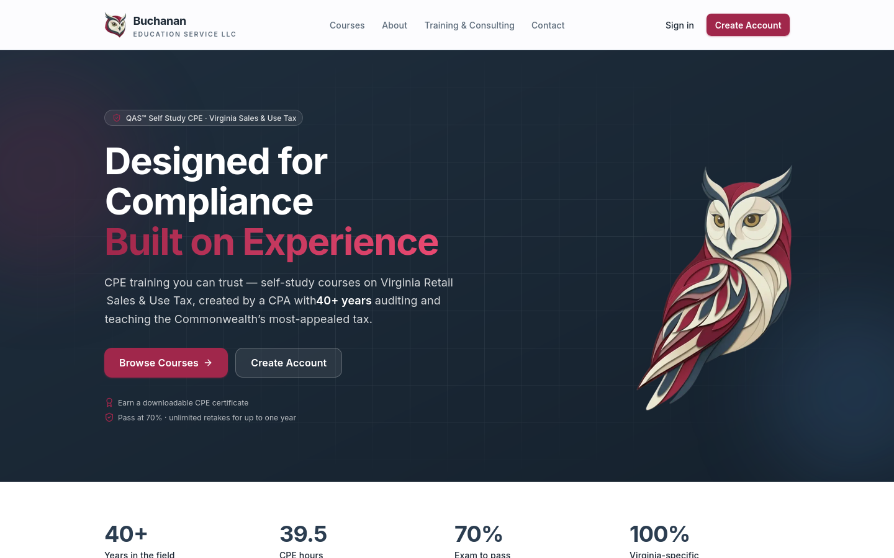
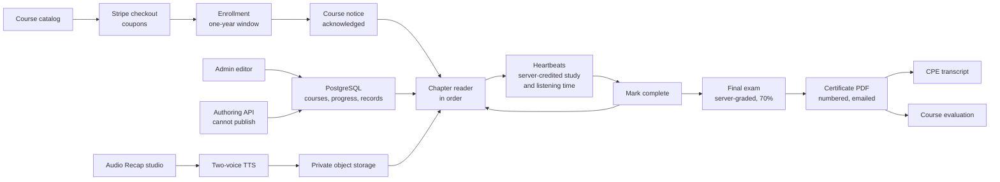
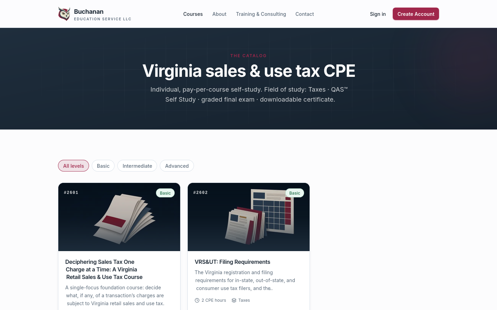
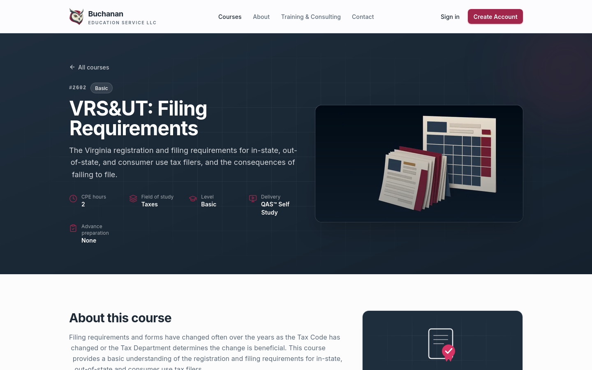

# Buchanan CPE

**Self-study CPE for CPAs on Virginia sales and use tax, built to NASBA's QAS Self Study standards, with the rules enforced by the server instead of left to trust.**

Live: [bescpe.com](https://bescpe.com)

---

## What it is

Buchanan CPE is the online school of Buchanan Education Service LLC, a Virginia firm that teaches Virginia Retail Sales & Use Tax to CPAs and tax professionals. CPAs must earn continuing-education (CPE) credit every year to keep their licenses, and state boards accept self-study credit only when the course meets a strict national standard. This platform sells the courses, delivers them, enforces that standard, and issues the certificates CPAs hand to their boards.

It has been live at bescpe.com since June 2026. Ten courses (39.5 CPE hours) are built on it, and the first courses opened for enrollment in late August 2026.

## What QAS self-study requires, in plain terms

NASBA (the National Association of State Boards of Accountancy) runs the Quality Assurance Service, or QAS, which sets the rules for self-study CPE. A non-accountant can think of them as the rules that make "I read a course online" count the same as sitting in a classroom.

| The rule | What it means | How the platform meets it |
|---|---|---|
| **Credit is earned by the clock** | One CPE credit is a 50-minute hour. For self-study, NASBA sets the credit with a formula: words read at 180 per minute, plus audio minutes, plus 1.85 minutes per question, divided by 50 and rounded down to the half credit. | Every course has a word-count index generated from the text as published, showing exactly what was counted and the result. On top of the formula, the reader makes learners actually spend the time: each chapter carries its share of the course's minutes, credited by the server only while the learner is present. |
| **Review questions along the way** | At least 3 practice questions per credit, inside the course, with feedback that explains right and wrong answers. | Each chapter ends with ungraded review questions that give instant feedback and an explanation. The authoring tools measure every course against the 3-per-credit floor. |
| **A real final exam** | At least 5 questions per credit, no true/false, a passing score of 70%, and questions that test at least 75% of the course's stated learning objectives. | The exam is graded on the server, with the full question bank in a fresh order every attempt. Answers never reach the browser before submission. Every course's exam tests 100% of its learning objectives, and a written map shows which question tests which objective. |
| **A completion window** | Self-study must be finished within one year of purchase. | Enrollment expires 365 days after purchase. Expiry is checked again at the moment the exam is submitted, not just when it is opened. |
| **A proper certificate** | The certificate must name the participant, course, field of study, delivery method, credits, date and sponsor, and carry NASBA's exact time statement. | A certificate with a unique number is issued automatically on the first pass, rendered as a PDF, emailed, and recorded on the learner's CPE transcript. |
| **Learner evaluations** | Participants must be able to evaluate each course, and the sponsor must review the results. | A course evaluation is offered after the certificate; Buchanan's team reviews the results per course in the admin area. |
| **Five-year records** | Completion records, evaluations and course materials must be kept for at least five years. | The platform refuses to delete a course while real learner records exist, and real evaluation responses cannot be deleted. |
| **Disclosures and study aids** | Each course must state its objectives, level, prerequisites, field of study, delivery method and revision date, and provide a glossary and an index. | Every course page shows those fields. Each course has a glossary that links each term to the chapters where it appears, full-text search, and an appendix of every legal authority the course cites. |

## Highlights

- **Time on content is measured by the server, not the browser.** The reader sends a heartbeat every 30 seconds only while the page is visible and the learner is active. The server credits the gap it measured itself, capped at 45 seconds per beat. A paused tab, a throttled timer or a tampered page can only cost the learner time, never grant it.
- **Required listening that can't be skipped.** Chapters end with an Audio Recap, a short two-voice conversation reviewing the chapter, with a transcript. "Mark complete" stays locked until 95% of it has been heard. Playback is fixed at normal speed, seeking past the furthest point heard is blocked, and the recap pauses when the learner leaves the page.
- **An exam that can't be gamed.** Correct answers stay on the server. A failed attempt shows the score and how many were wrong, never the correct answers. A 69.7% does not round up to a pass. Passing closes the exam for good and issues the certificate exactly once, even if two submissions race.
- **Gates that agree everywhere.** A learner must accept the course notice, finish chapters in order, meet each chapter's time and listening, and complete every chapter before the exam opens. Each rule is one shared function, so the course overview, the chapter page, the completion endpoint and the exam can never disagree.
- **The author's own courses, word for word.** Each course was ported from the instructor's original PDF and answer key, transcribed rather than rewritten. A checker confirms that every statute and ruling cited in an Audio Recap appears in the approved course text, so the audio never invents a citation.
- **A full back office.** Buchanan's team runs the business from an admin area: a course editor with autosave snapshots and one-click restore, an Audio Recap studio, Stripe checkout with coupons, learner and enrollment records, evaluation results, scoped team permissions, a built-in mailbox, and certificates for in-person training.
- **The NASBA application, built from the platform's own records.** Emergent prepared Buchanan's QAS sponsor application documents from live course data: word-count indexes and NASBA's formula forms for all ten courses, objective-to-exam maps, administrative policies, a privacy notice, sample certificates and promotional materials. The policy wording on the website and in the application documents comes from the same source text, so they can't drift apart.

## The brief and the outcome

**What Buchanan needed.** Buchanan Education Service had a catalog of Virginia sales and use tax courses written by its founder, a CPA with more than 40 years in the field. They existed as PDF documents with chapter knowledge tests and separate exam answer keys. Buchanan needed a place to sell them to CPAs as self-study CPE that state boards would accept. That meant meeting NASBA's QAS Self Study standards in the software itself, issuing certificates automatically, and giving a small team tools to run the courses, the customers and the email without a developer on call.

**What Emergent delivered.**

- A custom learning platform on Buchanan's own domain, live since June 2026, with checkout, a course player, a final-exam engine, certificates, CPE transcripts and an admin area.
- Ten courses ported faithfully from the author's documents into an interactive reader with chapters, review questions, tables, quoted Code sections, a glossary, search, a cited-authorities appendix and a downloadable reference PDF.
- Per-chapter Audio Recaps produced in-house with a two-voice text-to-speech pipeline, each checked against its chapter's text before publishing.
- The QAS rules built into the product: time on content, required listening, sequential chapters, review questions with feedback, a server-graded exam, the one-year window, record retention, and NASBA's exact certificate wording.
- The paperwork for Buchanan's NASBA QAS sponsor application, generated from the platform rather than typed by hand.

**What it changed.** Buchanan went from PDF documents to a working online school with its own storefront and back office. A purchase now leads straight to a course, an exam, a numbered certificate and a transcript, with no manual steps. The CPE hours on every course rest on a documented word count anyone can re-check. Before NASBA approves the sponsorship, a single setting keeps the official sponsor statement off certificates and the site, so the platform never claims a registration it doesn't yet hold.

## Architecture

The platform is a single Next.js application backed by PostgreSQL and private object storage. A learner buys a course through Stripe, which creates an enrollment that expires a year later. Inside the course, every page and endpoint asks the same shared gate functions whether the notice is accepted, whether earlier chapters are done, and how much study and listening time is still owed. All time is counted on the server from heartbeats, and the chapter-complete endpoint refuses until the time is met. The exam is graded on the server. The first pass issues a certificate PDF, stores it, emails it and adds it to the learner's transcript, and the course evaluation is offered next.

Course content enters through an admin editor or through an authenticated authoring API that can edit content but can never publish or unpublish a course. Audio Recaps are scripted from the chapter, voiced by a multi-speaker text-to-speech model, transcoded and stored privately. The app runs on [HostKit](https://github.com/codeslayer44/hostkit-showcase), Emergent's in-house hosting platform.

The full walk-through is in [docs/architecture.md](docs/architecture.md).

## Engineering notes

**The browser reports; the server decides.** Time on content is the easiest QAS rule to fake, so the browser holds no clock. It only decides when to send a heartbeat (page visible, learner active within the last minute, no "Still with us?" prompt open). The server credits the gap since the previous beat as it measured it, capped at 45 seconds, so a long gap can't credit itself and clock skew credits zero, never a negative or a windfall. Each chapter's requirement is the course's CPE minutes split by the chapter's share of the words, computed on every request rather than stored, so it can't go stale when an author edits the text.

**Listening had to be required without being annoying.** The rule is "the whole recap", but heartbeats land every 30 seconds, so the last few seconds can fall between beats. The gate asks for 95% to absorb that without letting anyone skip a meaningful part. Beats are closed at every state change: play, pause, end, and the page being hidden. Only real playback counts, not a press of the play button while the audio is still loading. The check was verified on the live site with a throwaway, non-exempt learner: the gate blocked, a jump ahead was pulled back, 2x speed snapped back to 1x, and the button unlocked as the recap ended.

**One rule, one function.** The notice gate, the chapter-order gate, the study-time math and the exam access check are each written once and called from every surface. The chapter-order gate is a pure function with one deliberate exception: a chapter the learner already finished stays open forever, so someone who studied before the gate shipped never finds finished work locked. If the database can't confirm that the notice was accepted or the recap was heard, the answer is no.

**Certificates are issued once, and never half-issued.** The certificate PDF is rendered and stored before its record is written, so a record always points at a real file. Certificate numbers run per year (`BES-2026-000123`) and are protected by a uniqueness constraint with a retry, so two simultaneous first passes can't collide. If email fails, the certificate is still issued and stays downloadable. The certificate itself is fully vector-drawn: an engraved border, rosettes and seal generated as line-work, after AI-generated raster backgrounds came out muddy.

**Compliance paperwork generated from the source of truth.** NASBA's application asks for a word count per course, objective-to-exam coverage, policies and samples. Instead of compiling those by hand, Emergent generated them from the published course data and recorded exactly what each count includes, so anyone can re-count a module's text and get the same number. The website's policy pages and the application documents read from the same text, which is why a full consistency check across the site, certificates, Program List, flyer and policies could pass.

## Tech stack

| Layer | Technology |
|---|---|
| App | Next.js 16 (App Router), React 19, TypeScript, Tailwind CSS 4 |
| Data | PostgreSQL with Prisma 7, versioned SQL migrations |
| Auth | Better Auth (email and password, magic links), scoped admin permissions |
| Payments | Stripe Checkout and webhooks, coupon codes |
| Email | Resend for transactional mail with a delivery webhook, IMAP and SMTP for the built-in team mailbox |
| Documents | `@react-pdf/renderer` for certificates, transcripts and course reference PDFs |
| Editor | Tiptap rich-text editor with tables, autosave snapshots and editor presence |
| Media | Gemini multi-speaker text-to-speech for Audio Recaps, ffmpeg transcoding, AI image studio, private S3-compatible storage |
| Content tooling | Node and Python scripts for faithful course porting and citation checks |
| Testing | Vitest (unit and route tests), Playwright (end-to-end) |
| Hosting | [HostKit](https://github.com/codeslayer44/hostkit-showcase), Emergent's in-house hosting platform |

## By the numbers

| | |
|---|---|
| Commits | 369 (2026-06-01 to 2026-10-05) |
| Source lines | 140,725 |
| Tracked files | 1,812 |
| Test files | 120 (about 1,300 test cases, counted from `it`/`test` calls) |
| SQL migrations | 12 |
| Languages | HTML 44.4%, TypeScript 31.9%, Python 20.3%, JavaScript 1.5%, PLpgSQL 1.3% |
| Courses built | 10, totalling 39.5 CPE hours |
| Learning objectives tested by each final exam | 100% (NASBA's floor is 75%) |

The application itself is TypeScript. Most of the HTML share is course content and review pages produced while porting courses, and most of the Python is content and tooling scripts.

## Screenshots

**Course catalog**

**Course detail page**

## About this repo

Buchanan CPE's source code is private. This repository documents what was built and how it works, and contains no source code from the product. Built by [Emergent AI Agency](https://emergentaiagency.com) (Ryan Chappell, [@codeslayer44](https://github.com/codeslayer44)) for Buchanan Education Service LLC.

For enquiries: [emergentaiagency.com](https://emergentaiagency.com).

*QAS is a trademark of the National Association of State Boards of Accountancy. This repository describes how the platform is built to NASBA's QAS Self Study standards; it does not state or imply NASBA registration.*
