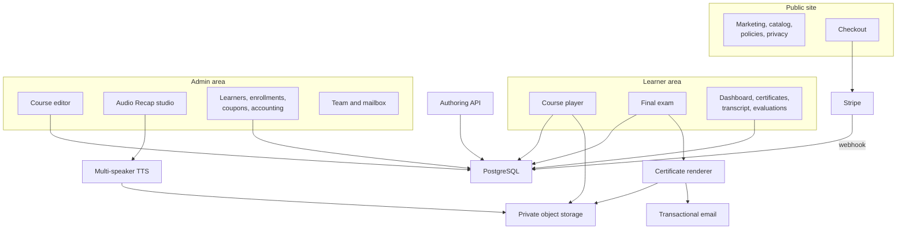
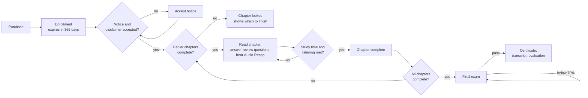

# Buchanan CPE: architecture

This page goes one level deeper than the [README](../README.md): the parts of the system, how a learner's credit is earned and protected, how content gets in, and the decisions behind them. It describes the design without reproducing source code.

## 1. Shape of the system

Buchanan CPE is one Next.js application (App Router, React 19, TypeScript) with a PostgreSQL database and private S3-compatible object storage. It runs as a single standalone Node server on [HostKit](https://github.com/codeslayer44/hostkit-showcase), Emergent's in-house hosting platform. There is no separate job queue. The one slow task, voicing an Audio Recap, runs as a detached in-process job that the admin screen polls.



Content is modelled as **course → chapter groups (sections) → chapters (lessons)**, with review questions attached to each chapter, one exam bank per course, glossary terms, cited authorities, inline images and Audio Recaps. Learner state lives in its own tables: enrollments, notice acknowledgements, chapter progress, per-chapter study and listening time, exam attempts, certificates and evaluations.

## 2. Earning a credit: the learner path and its gates

A credit is only as trustworthy as the weakest gate in front of it, so every gate is enforced on the server and written once.



**Shared gate functions.** The notice check, the chapter-order check, the study-time math and the exam access check each live in one module. The course overview, the chapter page, the chapter-complete endpoint and the exam all call them, so the screen a learner sees and the rule the server enforces cannot drift apart. The chapter-order check is a pure function: a chapter is open when every earlier chapter is complete, and a chapter the learner already completed stays open regardless.

**Exam access** resolves to one of a small set of states, and every caller handles all of them:

```ts
// illustrative
type ExamAccess =
  | { state: "ok"; expiresAt: Date }
  | { state: "incomplete"; reason: "notice" | "chapters"; remaining: number }
  | { state: "expired"; expiresAt: Date }
  | { state: "completed" }   // already passed: the exam is closed
  | { state: "forbidden" }   // signed in, not enrolled
  | { state: "not_found" };
```

Admins and a designated preview account can walk any course, including drafts, without an enrollment so content can be checked before release. That path is read-only for credit: it never issues a real certificate, and the study timer can be switched off for those viewers so reviewers aren't held to learner pacing.

## 3. Time on content

NASBA sets a self-study course's credit from a word-count formula. Buchanan also wanted learners to actually spend that time, so the reader enforces it.

- **Requirement per chapter.** The course's CPE minutes (credits × 50) are split across its chapters by each chapter's share of the words, with a one-minute floor. An author can override a chapter's minutes by hand. The value is computed on every request, never stored, so it follows every edit to the text or the credit.
- **Heartbeats, not a client clock.** The reader sends a beat every 30 seconds only while the page is visible, the learner has scrolled, clicked or typed within the last minute, and no "Still with us?" prompt is open. The server credits the gap since the previous beat as it measured it, capped at 45 seconds. A non-positive gap credits zero.
- **What the browser shows comes from the server.** The countdown next to "Mark complete" is the server's figure from the last beat. A throttled background tab or an edited page can lose the learner time, never add it.
- **Owner controls.** A site setting can switch the timer off entirely, or exempt admins and the preview account. The "How this course works" panel hides any step that isn't running for the current viewer, so the instructions never describe a rule that isn't enforced.

## 4. Required listening

Each chapter ends with an Audio Recap. Their minutes count toward the course's credit under NASBA's formula, which only holds if listening is required.

- The same heartbeat carries whether the recap actually played (with the page visible) through the interval it closes. The server adds its own measured gap to a separate listening total for that chapter.
- Beats close the interval at every state change (play, pause, end, page hidden), so an interval is never credited for a state it wasn't in. Only real playback counts. Buffering, errors and an emptied player stop the count.
- "Mark complete" stays refused until the learner has heard 95% of the published recap. The 5% allowance absorbs the last beat falling just short of the end.
- Playback is fixed at 1x, seeking past the furthest point heard is pulled back while listening is still owed, and the recap pauses when the learner leaves the page.
- Chapters without a published recap carry no listening requirement. The check runs against whichever recap the reader actually displays for that chapter.

This was checked end to end on the live site with a throwaway learner who was not exempt: the gate refused, the skip and speed changes were reverted, and the button unlocked as the recap finished. The account was removed afterwards.

## 5. Review questions and the final exam

**Review questions** are ungraded practice at the end of each chapter. Multiple-choice items show right or wrong immediately with an explanation. Short-answer items let the learner type a response, then reveal the model answer. Nothing is stored, and the answer key for practice is deliberately available to the page because instant feedback is the point.

**The final exam** is the opposite:

- The question type sent to the browser has no correct-answer field at all. Grading reads the key from the database on the server.
- Every attempt presents the whole bank in a freshly shuffled order.
- Pass is 70%, compared exactly: correct × 100 ≥ 70 × total, so 69.7% never rounds up to a pass.
- A failed attempt shows the score and how many were wrong, never the correct answers. A pass shows each question with the learner's answer and the correct one.
- Retakes have no cap within the one-year window. Enrollment expiry is checked again at submission, so a learner who lapses mid-exam is refused.
- Every attempt is stored with the answers as submitted, for the record.
- Passing closes the exam and the course for good. The certificate, transcript and cited-authorities appendix stay available.

**Measuring courses against NASBA's floors.** A pure measurement module checks a course against the reference floors: at least 5 exam questions and 3 review questions per credit, no exam question with fewer than three options, no review prompt duplicated on the exam, and a reminder to confirm objective coverage. The results are shown to authors as feedback. They don't block saving, because credit decisions belong to people and to NASBA, not to the software. Coverage itself was mapped by hand for each course: every final exam tests 100% of its course's learning objectives, against NASBA's 75% floor.

## 6. Certificates, transcripts and records

- **Issue once.** The exam-submit endpoint calls certificate issuance on the first pass. Issuance is idempotent per learner and course, so a double submit returns the existing certificate.
- **Unique numbers under concurrency.** Numbers run per calendar year (`BES-YYYY-NNNNNN`). The next number is an optimistic count, and a database uniqueness constraint is the real guard: on a collision the issuer recounts and retries.
- **File first, record second.** The PDF is rendered and stored before the certificate record is written, so every record points at a real file. If a record ever lacks its file, the download path regenerates it under the same number. Email failure never undoes an issued certificate.
- **The document.** Letter landscape, fully vector: a woven guilloché border, spirograph corner rosettes and a seal drawn as line-work, with the participant, course, number, field of study, delivery method, credits, completion date and NASBA's verbatim 50-minute-hour statement. The registry sponsor statement is controlled by one switch that stays off until NASBA approves the sponsor, and the same switch governs the policy page.
- **Transcript.** Every certificate becomes a transcript row. Learners can export their own transcript as a PDF or CSV.
- **Evaluations.** After the certificate, the learner is offered a course evaluation built from an editable question list. Each response stores the questions as they were asked, so editing the survey later never rewrites history. It never gates the certificate. Admins see results per course.
- **Retention.** A course cannot be deleted while any real learner holds an enrollment, attempt or certificate in it, and real evaluation responses cannot be deleted; only test responses can. Unpublishing a course hides it from the catalog and checkout but leaves enrolled learners their full access until their window ends.

## 7. Getting content in

**Faithful port.** The courses were the author's own documents: PDF course books with chapter knowledge tests and a separate exam answer key. A repeatable recipe turns each one into the platform's course structure. Chapters become sections, sub-headings become chapters, knowledge tests become review questions, and the exam becomes the exam bank with each correct answer taken from the key. The rule is to transcribe, not author: only layout damage (broken hyphenation, running headers, page numbers) is repaired, quoted Code sections and tables are kept as real structure, and every change is written to a change log.

**Audio Recaps.** A recap is a two-voice script (a host and a learner) written from one chapter alone. Before voicing, a checker validates the script: correct structure, no stray speaker labels or formatting, no "while you're driving" framing, and citation fidelity, meaning every statute, regulation, ruling or bulletin spoken in the script must appear in the approved chapter text. The studio then voices the script with a multi-speaker text-to-speech model in small retryable chunks, joins and transcodes the audio, and stores it privately. A failed or interrupted job never replaces a working recording, and a job left stuck by a restart is marked failed so it can be retried. Recordings were also transcribed back and compared with the script.

**Admin editor.** A rich-text editor with tables and inline images, autosave snapshots, and restore. A snapshot of the whole course is taken before structural deletes and restores, and the newest 30 are kept per course. An advisory presence indicator shows when someone else, or the same person in another tab, has the course open.

**Authoring API.** An authenticated API lets an AI authoring assistant read and edit course content directly. Three safeguards keep it safe to use on a live catalog:

- It can never set or change whether a course is published, including through rollback. New courses always start as drafts, and launch stays a human decision in the admin area.
- Every write must state the content version it was based on. A stale write is rejected rather than silently overwriting someone else's edit.
- Every write carries an idempotency token, so a lost response can be replayed safely, and every write is preceded by a snapshot it can be rolled back to.

**Study aids generated from the text.** The glossary's "where used" links are computed live from chapter text, never hand-curated, so they follow every edit. The cited-authorities appendix groups every Code of Virginia section, regulation, ruling, bulletin and case a course cites, with the passages where each appears, and is downloadable. Learners can also download a reference PDF of the course.

## 8. Running the business

- **Checkout.** Stripe Checkout with coupon codes. The enrollment is created from Stripe's webhook, and checkout refuses unpublished courses.
- **Team permissions.** Owners grant scoped capabilities (courses, customers, inquiries, financials, team management). Protected owner accounts cannot be changed from the team screens, and revenue figures are visible only to those with the financials permission.
- **Mail.** Transactional email is sent through Resend, and a signed, replay-guarded delivery webhook records each message's delivery status without ever downgrading it. The admin area also includes a webmail client over IMAP and SMTP with per-mailbox access grants, so the team works from one place.
- **Other tools.** Inquiries from the contact and consulting forms, learner and enrollment records, accounting views, and certificates for in-person training sessions.
- **Settings without deploys.** Integration keys and site text such as the sponsor block are managed in the admin settings, so they can be rotated or updated without a code change.

## 9. Compliance paperwork from the same data

For Buchanan's NASBA QAS sponsor application, the documents were generated from the platform rather than written separately:

- **Word-count indexes** for all ten courses, using NASBA's formula: (words ÷ 180 + audio minutes + questions × 1.85) ÷ 50, rounded down to the half credit. Each index lists the exact text counted per module, so a reviewer can re-count any module and get the same figure. Matching NASBA formula workbooks were produced alongside.
- **Objective-to-exam maps** showing which question tests which learning objective.
- **Administrative policies and the privacy notice**, rendered from the same source text the website's policy pages use.
- **Sample certificates, a Program List and promotional materials**, including a short video, checked for consistency against the live site.

A consistency check across the website, certificates, Program List, promotional materials and policy documents confirmed that course titles, hours, field of study, delivery method, objectives and organization name match everywhere.

## 10. Testing and verification

- **Unit and route tests (Vitest).** Together with the end-to-end specs below, 120 test files with about 1,300 test cases. They cover the credit math, both gates, exam grading and the answer-key boundary, the hidden exam explanations, certificate issuance, permissions, the authoring API's publish lock and rollback, snapshot handling, webhook signature checks, glossary matching, citations and retention guards.
- **End-to-end tests (Playwright)** for coupons and billing, the Audio Recap studio, the mailbox, and team management.
- **Live checks.** Rule changes that affect credit were verified on production with throwaway learners, with publish states captured before and after and the test accounts removed.
